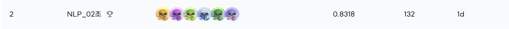
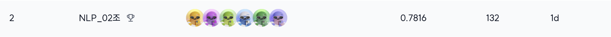
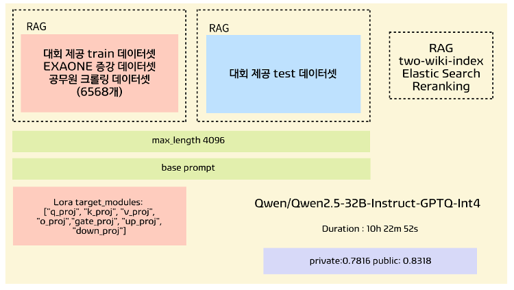

<div align='center'>

# 🏆 Lv.2 NLP Project : 수능 문제 풀이 AI 모델 생성
</div>

## ✏️ 대회 소개
|   특징   | 설명                                                                                                     |
|:------:|--------------------------------------------------------------------------------------------------------|
| 대회 주제  | 네이버 부스트캠프 AI-Tech 7기 NLP 트랙의 level 2 Generation for NLP 대회<br/>                                        |
| 대회 설명  | 한국어의 특성과 수능 시험의 특징을 바탕으로 수능에 특화된 AI 모델을 생성하는 프로젝트                                                      |
| 진행 기간  |2024년 11월 11월 ~ 2024년 11월 28일|
| 데이터 구성 | 학습데이터 셋: KMMLU / MMMLU(Ko) / KLUE MRC 중 2031개</br>평가데이터 셋: 수능형 문제 + KMMLU / MMMLU(Ko) / KLUE MRC 총 869개 |
| 평가 지표  | 정확도(Accuracy) = 모델이 맞춘 문제 수 / 전체 문제 수 |

## 🎖️ Leader Board
### 🥈 Public Leader Board (2위, 총 15팀)

### 🥈 Priavate Leader Board (2위, 총 15팀)


## 👨‍💻 Contributors
<table align='center'>
  <tr>
    <td align="center">
      <br>
      <a href="https://github.com/yeseoLee">
        
      </a>
    </td>
    <td align="center">
      <br>
      <a href="https://github.com/Sujinkim-625">
        
      </a>
    </td>
    <td align="center">
      <br>
      <a href="https://github.com/luckyvickyricky">
        
      </a>
    </td>
    <td align="center">
      <br>
      <a href="https://github.com/koreannn">
        
      </a>
    </td>
    <td align="center">
      <br>
      <a href="https://github.com/gayeon7877">
        
      </a>
    </td>
    <td align="center">
      <br>
      <a href="https://github.com/hsmin9809">
        
      </a>
    </td>
  </tr>
</table>

## 👼 역할 분담
| 이름 | 역할                                                                                          |
| --- |---------------------------------------------------------------------------------------------|
| 김민서 | 최적화 솔루션(DeepSpeed), 양자화(Optimizer Quantization), 난이도 기반 데이터 증강                              |
| 김수진 | EDA(국어영역과 사회영역 차이 분석), 데이터 수집, LLM을 활용한 데이터 증강, 프롬프트 실험                                     |
| 양가연 | EDA(국어영역과 사회영역 차이 분석), 데이터 수집, RAG 구현(Dense Retrieval)                                      |
| 이예서 | 메모리/속도 최적화, 양자화(BitsAndBytes, GPTQ), 데이터 수집, 데이터 정제, RAG 구현(Elastic Search, Reranker, RAFT) |
| 홍성민 | EDA(데이터 출처 기반 분석), LLM을 활용한 데이터 증강                                                          |
| 홍성재 | EDA(국어영역과 사회영역 차이 분석), streamlit 시각화                                                        |

## 📃 Results


## 🛠️**Dependencies**
```
# CUDA Version: 12.2
# Ubuntu 20.04.6
# python 3.10.13

# Deep Learning
auto_gptq==0.7.1
bitsandbytes==0.44.1
evaluate==0.4.3
huggingface-hub==0.26.2
numpy==2.0.0
optimum==1.23.3
peft==0.5.0
scikit-learn==1.5.2
torch==2.5.1 # 2.5.1+cu124
tqdm==4.67.0
transformers==4.46.2
trl==0.12.0
wandb==0.18.5

# RAG
elasticsearch==8.16.0
konlpy==0.6.0
rank-bm25==0.2.2
wikiextractor==3.0.6
faiss-cpu==1.9.0 # faiss-gpu==1.7.2

# Utils
beautifulsoup4==4.12.3
ipykernel==6.29.5
ipywidgets==8.1.5
loguru==0.7.2
matplotlib==3.9.2
python-dotenv==1.0.1
reportlab==4.2.5
streamlit==1.40.1
pdfminer.six==20240706

# Google Drive API
google-api-python-client==2.151.0
google-auth-httplib2==0.2.0
google-auth-oauthlib==1.2.1

# Automatically installed dependencies
# pandas==2.2.3
# pyarrow==18.0.0
# datasets==3.1.0
# safetensors==0.4.5
# scipy==1.14.1
# tqdm==4.67.0
# PyYAML==6.0.2
# requests==2.32.3

```
## 💾 Usage
1. Setting
```
$ pip install -r requirements.txt
```
2. train & inference
```angular2html
$ python3 code/main.py
```

## 📁 프로젝트 구조
```
code
 ┣ rag
 ┃ ┣ data_process
 ┃ ┃ ┣ external_data.py
 ┃ ┃ ┗ wiki_dump.py
 ┃ ┣ README.md
 ┃ ┣ __init__.py
 ┃ ┣ chunk_data.py
 ┃ ┣ dpr_data.py
 ┃ ┣ encoder.py
 ┃ ┣ index_runner.py
 ┃ ┣ indexers.py
 ┃ ┣ prepare_dense.py
 ┃ ┣ reranker.py
 ┃ ┣ retriever.py
 ┃ ┣ retriever_bm25.py
 ┃ ┣ retriever_elastic.py
 ┃ ┣ train.py
 ┃ ┣ trainer.py
 ┃ ┗ utils.py
 ┣ utils
 ┃ ┣ __init__.py
 ┃ ┣ common.py
 ┃ ┣ gdrive_manager.py
 ┃ ┗ hf_manager.py
 ┣ data_loaders.py
 ┣ inference.py
 ┣ labeling.py
 ┣ main.py
 ┣ model.py
 ┣ split.py
 ┗ trainer.py
 data_aug
 ┣ add_CoT.py
 ┗ aug_philo.py
 data_process
 ┣ crawling_gichulpass.py
 ┣ external_musr.py
 ┣ external_race.py
 ┣ external_sat_gaokao.py
 ┣ pdf_to_txt.py
 ┣ process_balance_choices.py
 ┣ process_formatting.py
 ┗ process_google_translate.py
 data_viz
 ┣ csv2pdf.py
 ┣ labeling.py
 ┗ streamlit_app.py
config
 ┣ sample
 ┃ ┣ config.yaml
 ┃ ┗ env-sample.txt
 ┗ elastic_setting.json
```
